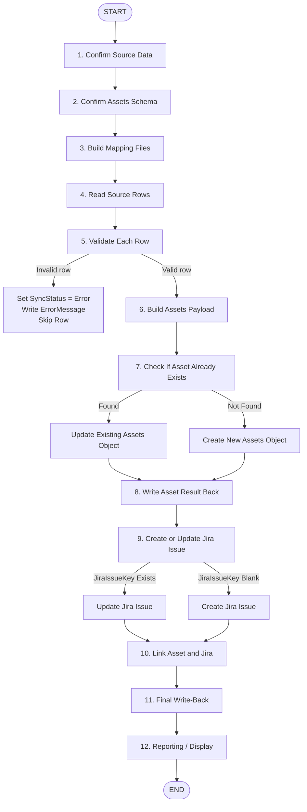

# Inventory Automation Workflow

This document outlines the current workflow for automating inventory management between the source data file, Atlassian Assets, Jira, and future reporting tools.

---

## High-Level Flow



---

## 1. Confirm Source Data

### Source Options

- Mock CSV or Excel file for testing
- Excel or SharePoint List later

### Required Source Columns

| Column | Purpose |
|---|---|
| `SourceRecordID` | Unique identifier from the source data |
| `ItemName` | Main name/title of the asset |
| `Category` | Used for mapping to Assets object types |
| `TargetObjectTypeID` | Assets object type where the row should be created |
| `AssetObjectID` | Stores the created or matched Assets object ID |
| `JiraIssueKey` | Stores the linked Jira issue key |
| `SyncStatus` | Tracks Pending, Success, or Error |
| `ErrorMessage` | Stores error details when something fails |

---

## 2. Confirm Assets Schema

Use the Assets API to:

- Get available schemas and object types
- Get attributes for each object type
- Save important IDs:
  - Object type IDs
  - Attribute IDs
  - Required attribute fields

---

## 3. Build Mapping Files

### Object Type Mapping

Maps source values to Assets object types.

| Source Value | TargetObjectTypeID |
|---|---|
| Laptop | 101 |
| Monitor | 102 |
| Printer | 103 |

### Attribute Mapping

Maps source columns to Assets attributes.

| Source Column | Assets Attribute |
|---|---|
| `ItemName` | Name |
| `SerialNumber` | Serial Number |
| `Location` | Location |

---

## 4. Read Source Rows

Only process rows where:

- `SyncStatus = Pending`
- `AssetObjectID` is blank
- `JiraIssueKey` is blank
- `ModifiedDate > LastSyncDate`

---

## 5. Validate Each Row

Check that each row has:

- `SourceRecordID`
- `ItemName`
- `TargetObjectTypeID`
- Required mapped attributes

If invalid:

```text
Set SyncStatus = Error
Write ErrorMessage
Skip row
```

---

## 6. Build Assets Payload

For each valid row:

- Use `TargetObjectTypeID`
- Load the matching attribute mappings
- Pull values from the source row
- Build the JSON body for the Assets API

---

## 7. Check If Asset Already Exists

Search Assets by:

- `SourceRecordID`, or
- `SerialNumber`

Then decide:

```text
If found:
    Update existing Assets object

If not found:
    Create new Assets object
```

---

## 8. Write Asset Result Back

Save the result back to the source file:

| Field | Value |
|---|---|
| `AssetObjectID` | Created or updated asset ID |
| `LastSyncDate` | Current timestamp |
| `SyncStatus` | Success or Error |
| `ErrorMessage` | Error details if failed |

---

## 9. Create or Update Jira Issue

```text
If JiraIssueKey exists:
    Update Jira issue

If JiraIssueKey is blank:
    Create Jira issue
```

---

## 10. Link Asset and Jira

Create a two-way relationship:

- Write `AssetObjectID` into a Jira field
- Write `JiraIssueKey` into an Assets attribute

---

## 11. Final Write-Back

Save final sync results:

| Field | Purpose |
|---|---|
| `JiraIssueKey` | Jira issue key |
| `JiraIssueID` | Jira internal issue ID |
| `AssetObjectID` | Assets object ID |
| `SyncStatus` | Final success/error state |
| `LastSyncDate` | Final sync timestamp |
| `ErrorMessage` | Cleared if successful |

---

## 12. Reporting / Display

Possible reporting layers:

- Jira dashboard
- Confluence page
- Later: Power BI or other reports

---

## Final Goal

The final goal is to create a repeatable Power Automate Desktop workflow that can read inventory data, validate it, create or update Atlassian Assets objects, create or update Jira issues, link them together, and write results back to the source file.

### Suggested Weekly Roadmap

Week 1:
  Confirm source columns.
  Create 5-row mock dataset.
  Confirm PowerShell can read the file.

Week 2:
  Pull object types from Assets.
  Pull attributes for each object type.
  Save ObjectTypeIDs and AttributeIDs.

Week 3:
  Build ObjectTypeMapping.csv.
  Build AttributeMapping.csv.
  Validate required fields.

Week 4:
  Build Assets JSON payload from one row.
  Create one object in Assets.
  Write AssetObjectID back to source.

Week 5:
  Add search-before-create logic.
  Update existing objects instead of duplicating.

Week 6:
  Add Jira issue creation.
  Save JiraIssueKey back to source.

Week 7:
  Link Jira issue and Assets object.

Week 8:
  Add logging, error handling, and documentation.